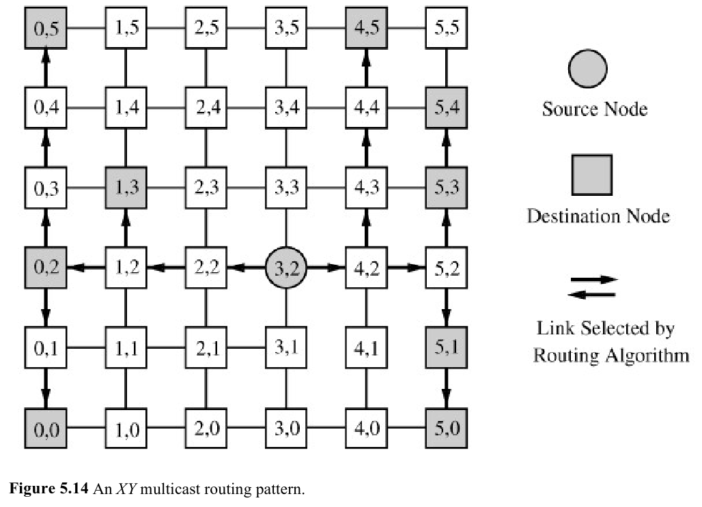
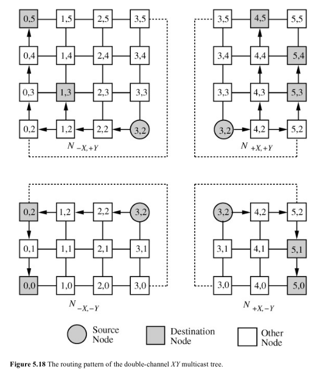
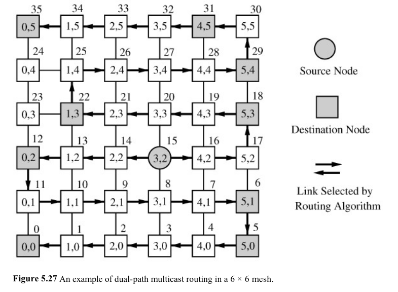
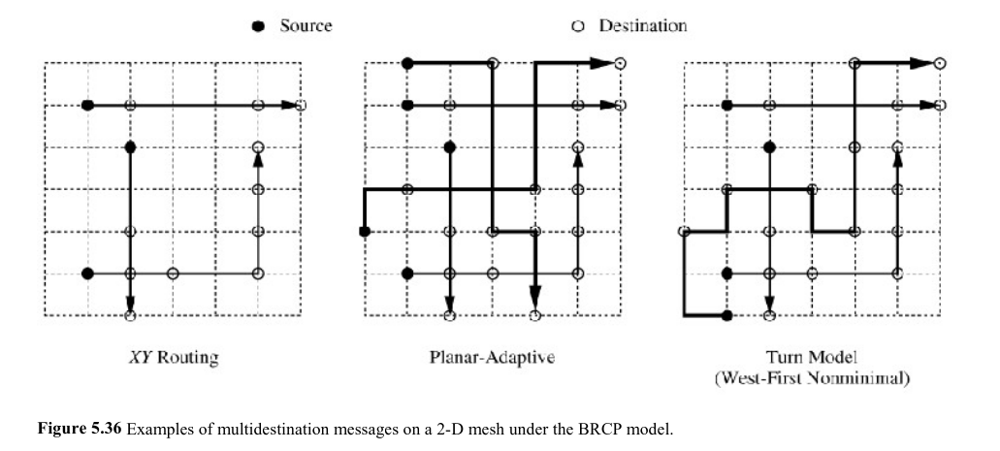

# Multicast Development Notes

Richard Bachmann


## 2023-04-02 -- se.py has been deprecated

I switched to the `develop` branch (as recommended by the gem5 contribution docs),
compiled it, and tried running a test simulation using se.py.
I got the following error:
```
fatal: The 'configs/example/se.py' script has been deprecated.
It can be found in 'configs/deprecated/example' if required.
Its usage should be avoided as it will be removed in future releases of gem5.
```
I need to know why se.py was deprecated and what the recommended alternative is.

Using git-blame and git-show, I found the commit where this was changed.
Here is a link to the code review and discussion:
https://gem5-review.googlesource.com/c/public/gem5/+/68157 .

There is not much info here, but the conversation indicates
the gem5 developers really want people to stop using se.py and fs.py.

More information:
https://gem5.atlassian.net/browse/GEM5-1278

> This whole process is a big thumbs-up from me.
> These scripts are causing us a lot of headaches and have become difficult to maintain.
> The gem5 stdlib should be able to meet the vast majority of se/fs.py use-cases come the next release.

## 2023-04-02 -- gem5 stdlib

https://www.gem5.org/documentation/gem5-stdlib/overview

The gem5 standard library was introduced in 2021.
It looks like it is intended to be an easy way to set up gem5 simulations in python.

This is neat:

> A core feature of the gem5 stdlib resource package is that
> it allows users to automatically obtain prebuilt gem5 resources for their simulation.
> A user may specify in their Python config file that a specific gem5 resource is required and,
> when run, the package will check if there is a local copy on the host system,
> and if not, download it.


## 2023-04-04

### Add option to enable multicast

Before actually adding multicast support,
we need a way for the user to choose between running a simulation with and without multicast support.
This is important for testing.

Doing so will probably require seeing how the gem5 stdlib does it.
This looks useful:
https://www.gem5.org/documentation/gem5-stdlib/develop-own-components-tutorial

> The gem5 standard library code resides in src/python/gem5

### Garnet and gem5 stdlib

How does garnet work with gem5 stdlib?
I haven't tried using garnet with the stdlib yet.

I looked through `src/python/gem5` and I couldn't find any indication of garnet support.
The developers probably haven't gotten to it yet.

This isn't a big problem, because we can still use se.py to set up the simulations
(it's just been moved to a 'deprecated' directory).
I'll need to look at se.py to try and figure out how to add a way to toggle-on multicast.
While I'm doing that, I may find it would be easy to add stdlib support for garnet myself,
according to the tutorial.

### Examining se.py

se.py doesn't directly handle garnet options.

Here are some relevant lines:
```
addToPath("../../")

from ruby import Ruby

from common import Options
```
and
```
parser = argparse.ArgumentParser()
Options.addCommonOptions(parser)
Options.addSEOptions(parser)

if "--ruby" in sys.argv:
    Ruby.define_options(parser)
```

### Examining configs/ruby/Ruby.py

In `def create_system`, it looks like the garnet configuration is passed to
configs/network/Network.py and configs/topologies/.

We aren't making any topology modifications, so I'll just look at Network.py.

### Examining configs/network/Network.py

A lot of the NoC-specific options are defined here.

`def create_network` and `init_network` look especially relevant.

There is a 'NetworkClass' class defined in some other file.

It carries some important info about the network and seems to be passed to
`init_network` at some point.
It might be a good place to add the multicast toggle.

Wait, NetworkClass is not a class, it is a variable that is assigned either
'GarnetNetwork' or 'SimpleNetwork'.

From grep:
```
src/mem/ruby/network/garnet/GarnetNetwork.py:class GarnetNetwork(RubyNetwork):
```

### Examining src/mem/ruby/network/garnet/GarnetNetwork.py

I'm out of the configs and into the src now.
I need to figure out how to set a C++ boolean (for the multicast toggle) with python.

It looks like this is being done with a `Param` object.
I think Hansika mentioned this before.

### Adding new params:

How do I add new variable to Param? Solution:
https://www.gem5.org/documentation/learning_gem5/part2/parameters/

On the python side:
```
time_to_wait = Param.Latency("Time before firing the event")
```

On the c++ side:
```
HelloObject::HelloObject(const HelloObjectParams &params) :
    SimObject(params),
    event(*this),
    myName(params.name),
    latency(params.time_to_wait),
    timesLeft(params.number_of_fires)
{
    DPRINTF(Hello, "Created the hello object with the name %s\n", myName);
}
```
I've seen this kind of code in the garnet src before.

### se.py or stdlib?

In https://gem5.atlassian.net/browse/GEM5-1278
(noted earlier) it says:

> This is a stepping stone to remove fs.py and se.py and all (or most) of the option library from gem5

The gem5 developers do not like the current strategy of command-line options being
passed around to set the params.
However, trying to rewrite all of this configuration stuff into gem5 stdlib looks
time consuming and is a yet another detour from the detour we are currently on.
I think it would be best to just add another option and continue using se.py.


## 2023-04-05

Where in the garnet src files should the multicast toggle param be added?

In src/mem/ruby/network/garnet/GarnetNetwork.cc,
the GarnetNetwork constructor accepts many params,
including 'routing_algorithm' and 'ni_flit_size'.
It seems reasonable to have it handle the multicast toggle.

### Adding the multicast toggle param

Steps:
- Register the command line option.
- Make sure the option is passed to the correct param-setting function.
- Register a new param.
- Read the param in the GarnetNetwork constructor.
- Print a debug message indicating the option was or was not set.

### Registering the flag

I added a --multicast flag to my simulation command.
The command failed when run (as it should).

I added the following to configs/network/Network.py:
```
    parser.add_argument(
        "--multicast",
        action="store_true",
        default=False,
        help="Enable multicast routing. Default is multiple-unicast.",
    )
```
The simulation no longer fails and, when you append --help to the command,
it prints out this message:
```
  --multicast           Enable multicast routing. Default is multiple-unicast.
```

### Registering the param

In src/mem/ruby/network/garnet/GarnetNetwork.py, class GarnetNetwork, I added:
```
    enable_multicast = Param.Bool(False, "enable multicast routing")
```
And in configs/network/Network.py, def init_network, I added:
```
        network.enable_multicast = options.multicast
```
When I ran the simulation, I got this error:
```
AttributeError: Class GarnetNetwork has no parameter enable_multicast
```
Even though I was only editing python files, I think I need to recompile gem5.
```
scons ./build/X86/gem5.opt -j 6
```
Error:
```
scons: *** [build/X86/systemc/tlm_core/2/quantum/global_quantum.o]
TypeError : File /home/rb/uf/research/gem5-multicast/src/systemc/ext/systemc found
where directory expected.
scons: building terminated because of errors.
```
Solution: delete build folder and recompile.
https://stackoverflow.com/questions/60520776/error-when-building-gem5-typeerror-file-hdd-me-gem5-src-systemc-ext-systemc?rq=2

After recompiling, the se-hello.sh script runs.
There is still no change in output at this point.


## 2023-04-06

### Connecting the --multicast flag to GarnetNetwork.cc

The python changes are done.
Now I need to add the param to the GarnetNetwork constructor in GarnetNetwork.cc.
I also need to add a variable in GarnetNetwork.hh.

In src/mem/ruby/network/garnet/GarnetNetwork.hh, in the 'protected' category, I add:
```
    bool m_enable_multicast;
```
All of the member variables in the class are prefixed with 'm_'.
I'll follow the convention.

In src/mem/ruby/network/garnet/GarnetNetwork.cc, in the constructor, I add:
```
    m_enable_multicast = p.enable_multicast;
```

To test this, I'll add a debug print statement.
gem5 had a macro for this called DPRINTF:
https://www.gem5.org/documentation/learning_gem5/part2/debugging/

Out of all of the available debug flags,
'RubyNetwork' is probably the most appropriate.
It might be worth adding a 'multicast' debug flag later though.

Here's what I added:
```
    if (m_enable_multicast)
        DPRINTF(RubyNetwork, "Multicast enabled.\n");
    else
        DPRINTF(RubyNetwork, "Multicast not enabled."
            " Using multiple-unicast instead.\n");
```

I recompile gem5 and add `--debug-flags=RubyNetwork` to se-hello.sh.

It produces a ton of output, but towards the top is the following line:
```
      0: system.ruby.network: Multicast enabled.
```

To add a new debug flag, I add this to the 'SConscript' file in the same directory:
```
DebugFlag('GarnetMulticast')
```
And I change the DPRINTFs to use the new flag.

I also needed to add this to GarnetNetwork.cc:
```
#include "debug/GarnetMulticast.hh"
```

After recompiling and changing se-hello.sh to use `--debug-flags=GarnetMulticast`,
far less debug output is produced, with just the desired line.

Removing the `--multicast` flag produces:
```
      0: system.ruby.network: Multicast not enabled. Using multiple-unicast instead.
```

The multicast toggle is now installed.

### Next steps

Hansika and I already decided on a flit encoding strategy (destination bitvector).
I need to figure out how many flits each packet will consist of.
I also need to figure out which routing algorithm to implement.


## 2023-04-07

### Multicast control message size

Formula I came up with to calculate multicast control message size:
```
size = normal control message size
       - num bits used for single destination
       + num bits used for bitvector of destinations
```

In src/mem/ruby/network/Network.py:
```
    control_msg_size = Param.Int(8, "")
```

And in https://www.gem5.org/documentation/general_docs/ruby/garnet-2/:

> control_msg_size: The size of control messages in bytes.
> Default is 8.
> m_data_msg_size in Network.cc is set to the block size in bytes + control_msg_size.

Why is it 8?
My searches aren't turning up any reasons.

I'm guessing 8 is just an arbitrary value,
intended to be changed according to the hardware being simulated.
If this is the case, I'll need to look into real flit encoding strategies
to get a sense of what goes into a control message.

To encode a single destination on a network with 16 nodes, you need 4 bits.
To encode multiple destinations on a similar network, you need 16 bits.
In this example, 8 + 2 = 10 bytes is a reasonable control message size.

Possible revised multicast message size:
```
size = control message size
       + num bits used for bitvector of destinations
```


## 2023-04-11

### Researching multicast routing algorithms

"Interconnection networks an engineering approach",
Duato 2003

https://ufl-flvc.primo.exlibrisgroup.com/permalink/01FALSC_UFL/175ga98/alma990206564170306597

#### "5.4 Models for Multicast Communication",

- Optimal Multicast Path (OMP) -- Find the shortest path with no branches
visiting all nodes.

- Optimal Multicast Cycle (OMC) -- Similar to OMP, but the source node is also
the final destination. Satisfies the need for destination nodes to
acknowledge receipt.

- Minimal Steiner Tree (MST) -- A tree with minimal total length that connects
the source to all destination nodes.

- Optimal Multicast Tree (OMT) -- Goal is to minimize time to get from source
to destinations. Total length may be longer than MST.

The problems of finding an OMP, OMC, or MST for a 2D-mesh are NP-complete.

#### "5.5 Hardware Implementations of Multicast"

##### "5.5.2 Tree-based Multicast Routing"

This section has a really good explanation of multicast routing and hardware
requirements.

> The spanning binomial tree is suitable for networks supporting SAF or VCT
> switching techniques. When combined with wormhole switching, tree based
> multicast routing suffers from several drawbacks. Since there is no message
> buffering at routers, if one branch of the tree is blocked, then all are
> blocked.

> Tree based multicast routing may cause a message to hold many channels for
> extended periods, thereby increasing network contention. Moreover, deadlock
> can occur using such a routing scheme.

A naive extension of the XY routing algorithm to multicast can cause deadlock:

> In a similar manner, you may attempt to extend deadlock free unicast routing
> on a 2 D mesh to encompass multicast. An extension of the XY routing method
> to include multicast is shown in Figure 5.14, in which the message is
> delivered to each destination in the manner described. As in the hypercube
> example, the progress of the tree requires that all branches be unblocked.
> For example, suppose that the header flit in Figure 5.14 is blocked due to
> the busy channel [(4, 2), (4, 3)]. Node (4, 2) cannot buffer the entire
> message. As a result of this constraint, the progress of messages in the
> entire routing tree must be stopped. In turn, other messages requiring
> segments of this tree are also blocked. Network congestion may be increased,
> thereby degrading the performance of the network. Moreover, this routing
> algorithm can lead to deadlock.

> Double Channel XY Multicast Wormhole Routing

> The following double channel XY multicast routing algorithm for wormhole
> switching was proposed by Lin, McKinley, and Ni [206] for 2 D mesh. The
> algorithm uses an extension of the XY routing algorithm, which was shown
> above to be susceptible to deadlock. In order to avoid cyclic channel
> dependencies, each channel in the 2 D mesh is doubled, and the network is
> partitioned into four subnetworks

> While this multicast tree approach avoids deadlock, a major disadvantage is
> the need for double channels. It may be possible to implement double channels
> with virtual channels; however, the signaling for multicast communication is
> more complex. Moreover, the number of subnetworks grows exponentially with
> the number of dimensions of the mesh, increasing the number of channels
> between every pair of nodes accordingly.

This is interesting:

> Tree based multicast routing is more suitable for SAF or VCT switching than
> for wormhole switching. The reason is that when a branch of the tree is
> blocked, the remaining branches cannot advance if wormhole switching is used.
> There is a special case in which tree based multicast routing is suitable for
> networks using wormhole switching: the implementation of invalidation or
> update commands in DSMs with coherent caches [224]. Taking into account the
> growing interest in these machines, it is worth studying this special case.

> Message data only require a few flits. Typically, a single 32 bit flit
> containing a memory address is enough for invalidation commands. The command
> itself can be encoded in the first flit together with the destination node
> address. An update command usually requires one or two additional flits to
> carry the value of the word to be updated. Hence, it is possible to design
> compact hardware routers with buffers deep enough to store a whole message.
> However, when multicast routing is considered, the message header must encode
> the destination addresses. As a consequence, message size could be several
> times the data size. Moreover, messages have a very different size depending
> on the number of destinations, therefore preventing the use of fixed size
> hardware buffers to store a whole message. A possible solution consists of
> encoding destination addresses as a bit string (see Section 5.5.1) while
> limiting the number of destination nodes that can be reached by each message
> to a small value. This approach will be studied in Section 5.6 and applied to
> the implementation of barrier synchronization and reduction.

An alternative "pruning method" of preventing deadlock is described, where a
some destinations of a unicast method can be split off into multiple-unicast
messages if needed. I'll need to reread this section later.

At the start of the next section:

> To support deadlock free multicast or broadcast wormhole routing, the tree
> based communication pattern does not perform well unless messages are very
> short because the entire tree is blocked if any of its branches are blocked.

This is interesting, because Paper 4 ("Multicast On-Chip Traffic Analysis
Targeting Manycore NoC Design") says:

> In the MESI coherence protocol, multicast messages are mostly invalidations
> which are generated upon a write to shared data and sent to the cores that
> are currently sharing it. Invalidations are short control messages, assumed
> to be of 8 bytes in our scenario.

> short messages account for more than 99% of the multicast in average. This
> figure is rather independent of the system size and, in fact, rarely drops
> below 98%.


## 2023-04-12

### "5.5.3 Path Based Multicast Communication"

This seems to indicate path-based routing requires a list of destinations
instead of a bitvector:

> In path based routing, the header of each copy of a message consists of
> multiple destinations. The source node arranges these destinations as an
> ordered list, depending on their intended order of traversal. As soon as the
> message is injected into the network, it is routed based on the address in
> the leading header flit corresponding to the first destination. Once the
> message header reaches the router of the first destination node, the flit
> containing this address is removed by the router. Now the message is routed
> to the node whose address is contained in the next header flit.

#### "Base Routing Conformed Path"

> Deadlock avoidance is considerably simplified if unicast and multicast
> routing use the same routing algorithm. Moreover, using the same routing
> hardware for unicast and multicast routing allows the design of compact and
> fast routers. The Hamiltonian path based routing algorithms proposed in
> previous sections improve performance over multiple unicast routing. However,
> their development has been in a different track compared to e cube and
> adaptive routing. Moreover, it makes no sense sacrificing the performance of
> unicast messages to improve the performance of multicast messages, which
> usually represent a much smaller percentage of network traffic. Thus, as
> indicated in [269], it is unlikely that a system in the near future will be
> able to take advantage of Hamiltonian path based routing.

> The base routing conformed path (BRCP) model [269] defines multicast routing
> algorithms that are compatible with existing unicast routing algorithms. This
> model also uses path based routing. The basic idea consists of allowing a
> multidestination message to be transmitted through any path in the network as
> long as it is a valid path conforming to the base routing scheme. For
> example, on a 2 D mesh with XY routing, a valid path can be any row, column,
> or row column.

### Difficulties

While I was reading the ebook, a message popped up saying "this session is no
longer valid". When I reloaded the page, it said someone is reading the book
and I will have to wait. Brilliant.


## 2023-04-13

### Summary of 3 routing algorithm options

#### Double-Channel XY Multicast Wormhole Routing

An extension of XY to multicast. Requires double channels to prevent deadlock.

> It may be possible to implement double channels with virtual channels;
> however, the signaling for multicast communication is more complex.





#### Dual-Path Routing

Nodes in the network are given an ordering. Destination addresses for a
multicast message are sorted according to this ordering. The message travels
along the path to the next destination. When that destination is reached, it is
removed from the message's list and the message is passed to the next
destination.

"Dual-path" refers to how the source initially sends two messages in opposite
directions. The book describes an extension to this using 4 directions, but it
has some disadvantages.

Note: this will not work with the bitvector destination encoding strategy. It
requires an ordered list. If implemented in gem5, it would require changing the
message size as it travels along. I don't know how hard this would be. If
necessary, we could leave the message size at its longest the entire time, but
we wouldn't see the same performance improvement.



#### Base-Routing Conformed Path

A multicast message can be sent only if it's total path is a valid path
according to the unicast algorithm being used. Multicast messages may need to
be split into smaller multicast messages to conform to this requirment.

Note:

> if the base routing algorithm is deadlock free, the multicast routing
> algorithm is also deadlock free.

Grouping destinations into valid multicasts requires some work:

> Once the set of valid paths for multidestination messages has been
> determined, it is necessary to define routing algorithms for collective
> communication. The hierarchical leader based (HL) scheme has been proposed in
> [269] to implement multicast and broadcast. Given a multicast destination
> set, this scheme tries to group the destinations in a hierarchical manner so
> that the minimum number of messages is needed to cover all the destinations.

The grouping algorithm is descibed next in the book.



### Easiest option to implement

All 3 options probably could be successfully implemented. If I had to guess,
double-channel XY would take the least amount of work to do so.

### More options

The 2003 Duato book listed a few more routing algorithms, but they were either
more complex or specialized.

2003 was a long time ago; better algorithm have probably been found since then.
The book provides citations for the algorithms it discusses.
I can look for them on IEEE and look for newer papers that cited them proposing better algorithms.


## 2023-05-01

I'm looking at flitisizeMessage in NetworkInterface.cc.
One RouteInfo struct is created for the message, and passed with each flit.
RouteInfo is defined in CommonTypes.hh, and has the following attributes:
```
    // destination format for table-based routing
    int vnet;
    NetDest net_dest;

    // src and dest format for topology-specific routing
    int src_ni;
    int src_router;
    int dest_ni;
    int dest_router;
    int hops_traversed;
```
net_dest, dest_ni, and dest_router are problematic.
In my initial survey of the code, I didn't notice this.
RouteInfo was designed with only one destination in mind,
and will need to be modified to allow for multiple destinations.

I'll need to change each of these single variables to vectors,
and I'll also need to change every part of the code that references these to treat
them as vectors (even if they are just vectors of length 1 in multiple-unicast mode).
Here's where RouteInfo is mentioned:
```
$ grep -lr RouteInfo
simple/PerfectSwitch.cc
simple/routing/WeightBased.cc
simple/routing/BaseRoutingUnit.hh
simple/routing/WeightBased.hh
garnet/Router.cc
garnet/GarnetNetwork.cc
garnet/NetworkInterface.cc
garnet/Router.hh
garnet/RoutingUnit.cc
garnet/flit.hh
garnet/GarnetNetwork.hh
garnet/RoutingUnit.hh
garnet/CommonTypes.hh
garnet/flit.cc
garnet/Credit.cc
```

Hopefully the required changes aren't too involved.
I created a new branch, RouteInfo-modification, so I don't mess up my working code.


## 2023-05-02

These files all mention the problematic elements of RouteInfo:
```
$ grep -lr 'net_dest\|dest_ni\|dest_router'
garnet/GarnetNetwork.cc
garnet/NetworkInterface.cc
garnet/RoutingUnit.cc
garnet/RoutingUnit.hh
garnet/CommonTypes.hh
garnet/flit.cc
```
I think its safe to ignore the other files in my list from yesterday.

Here are the lines as well:
```
$ grep -r 'net_dest\|dest_ni\|dest_router'
GarnetNetwork.cc:    int dest_node = route.dest_router;
NetworkInterface.cc:        route.net_dest = new_net_msg_ptr->getDestination();
NetworkInterface.cc:        route.dest_ni = destID;
NetworkInterface.cc:        route.dest_router = m_net_ptr->get_router_id(destID, vnet);
RoutingUnit.cc:    if (route.dest_router == m_router->get_id()) {
RoutingUnit.cc:        outport = lookupRoutingTable(route.vnet, route.net_dest);
RoutingUnit.cc:            lookupRoutingTable(route.vnet, route.net_dest); break;
RoutingUnit.cc:            lookupRoutingTable(route.vnet, route.net_dest); break;
RoutingUnit.cc:    int dest_id = route.dest_router;
RoutingUnit.hh:    int  lookupRoutingTable(int vnet, NetDest net_dest);
CommonTypes.hh:        : vnet(0), src_ni(0), src_router(0), dest_ni(0), dest_router(0),
CommonTypes.hh:    NetDest net_dest;
CommonTypes.hh:    int dest_ni;
CommonTypes.hh:    int dest_router;
flit.cc:    out << "Dest NI=" << m_route.dest_ni << " ";
flit.cc:    out << "Dest Router=" << m_route.dest_router << " ";
```


### GarnetNetwork.cc

So there's this function called "update_traffic_distribution".
I'm guessing its used for recording statistics.
```
void
GarnetNetwork::update_traffic_distribution(RouteInfo route)
{
    int src_node = route.src_router;
    int dest_node = route.dest_router;
    int vnet = route.vnet;

    if (m_vnet_type[vnet] == DATA_VNET_)
        (*m_data_traffic_distribution[src_node][dest_node])++;
    else
        (*m_ctrl_traffic_distribution[src_node][dest_node])++;
}
```

I am correct. Looking at GarnetNetwork.hh, I find:
```
    std::vector<std::vector<statistics::Scalar *>> m_data_traffic_distribution;
    std::vector<std::vector<statistics::Scalar *>> m_ctrl_traffic_distribution;
```

To make this work for multiple destinations,
I think I'll have it loop through the destinations and update the corresponding
part of the traffic distribution.
But first, I should look to see where update_traffic_distribution is called to
see if this plan makes sense.

update_traffic_distribution is called in one place: flitisizeMessage.

I think my plan is reasonable.

### NetworkInterface.cc

This is where flitisizeMessage is, which was the original cause for these changes.

### RoutingUnit.cc

This one is tricky.
This file is where the 'outportCompute' functions are.

TABLE and XY can only be used with multiple-unicast,
so whatever changes I make need to leave these alone.

The first issue is the fact that outportCompute only returns one outport.
To handle multicast, outportCompute needs to be able to return multiple outports,
each with a subset of the destinations associated with them.
As in, these destinations need to be sent through this outport,
and those destinations through that outport.

outportCompute is called by one other function, route_compute (in Router.cc).
route_compute is called by 'wakeup' in InputUnit.cc.
Here's the problem area:
```
            // Route computation for this vc
            int outport = m_router->route_compute(t_flit->get_route(),
                m_id, m_direction);

            // Update output port in VC
            // All flits in this packet will use this output port
            // The output port field in the flit is updated after it wins SA
            grant_outport(vc, outport);

```
In this code, the outport is computed from the head flit,
and every flit is sent along that outport.
What needs to happen, is that the set of outports with corresponding destinations
is computed, and every flit is sent to every outport with only the
corresponding destinations.

Essentially, if the message needs to split off at this point, new RouteInfos
need to be constructed and associated with the flits.

The above code calls grant_outport, which is defined in InputUnit.hh:
```
    inline void
    grant_outport(int vc, int outport)
    {
        virtualChannels[vc].set_outport(outport);
    }
```
This is also problematic, because each virtual channel can only have one outport
associated with it here.
```
    // Input Virtual channels
    std::vector<VirtualChannel> virtualChannels;
```


## 2023-05-05

### RoutingUnit.hh

Just a function prototype.

### CommonTypes.hh

Contains the definition of RouteInfo.

### flit.cc

Print statement for debugging. Easy to change.

### Summary

It seems like the main issues are:

- Modify all of the destination variables to allow for storing multiple
destinations.

- The routers are currently designed to pass flits forward, unchanged. However,
with multicast the routers need to remove destinations when they are reached
and split destinations sets at branches. The flit object provides a set_route
method, which we can use for this. It is unknown to me if there is any code is
based on the assumption the destination of a flit does not change.

- The code currently allows granting only one outport to a virtual channel at a
time. In order to allow branching with wormhole routing, a virtual channgel
needs up to two outports at once. This seems like the type of change that could
allow deadlock to occur.

From https://www.gem5.org/documentation/general_docs/ruby/garnet-2/

> vcs_per_vnet: number of virtual channels (VC) per virtual network. Default is
> 4. This can also be set from the command line with –vcs-per-vnet.

> Flow Control
>
> Virtual Channel Flow Control is used in the design. Each VC can hold one
> packet. There are two kinds of VCs in the design - control and data. The
> buffer depth in each can be independently controlled from GarnetNetwork.py.
> The default values are 1-flit deep control VCs, and 4-flit deep data VCs.
> Default size of control packets is 1-flit, and data packets is 5-flit.

From the Interconnection Networks book:

> The algorithm uses an extension of the XY routing algorithm, which was shown
> above to be susceptible to deadlock. In order to avoid cyclic channel
> dependencies, each channel in the 2 D mesh is doubled, and the network is
> partitioned into four subnetworks, N_(+X,+Y), N_(+X,Y), N_(X,+Y), and N_(X,Y).

> While this multicast tree approach avoids deadlock, a major disadvantage is
> the need for double channels. It may be possible to implement double channels
> with virtual channels; however, the signaling for multicast communication is
> more complex.

Garnet already has multiple virtual channels, but separates their use according
to packet type. The multicast-XY algorithm requires them to be separated
according to direction of packet travel. So the number of virtual channels in
garnet will still need to be doubled.

I am not completely sure why gem5 uses separate VCs for control and data
packets, but my guess is that it prevents control packets from being slowed
down during large data transfers in the network. I do not know if this is an
just an optimization, or if it is necessary to prevent deadlock.


## 2023-05-07

It's not really possible to test the multicast code as I write it.
I need all of the code to be done before multicast will work.
However, I can run gem5 in unicast mode to make sure my changes haven't broken
the existing functionality.

The routing table is used by all routing algorithms, so net_dest must be made
to work with multiple destinations.

On Friday, Hansika suggested trying to structure the code modifications so that
the existing outportCompute functions can be used as-is on a per destination basis,
with some code outside of it that groups the destinations and duplicates the
flits if needed.
I think this is a good idea.

It might be possible to leave the RouteInfo struct as-is, and simply modify the
flits to carry a vector of RouteInfo.
InputUnit::wakeup will run route_compute (a wrapper for outportCompute)
on each route in the head flit.

InputUnit::wakeup calls "advance_stage" on the flit.
advance_stage is also called in SwitchAllocator.cc and CrossbarSwitch.cc.
Each flit has an "m_outport" variable.
SwitchAllocator::arbitrate_outports sets the outport for the flit.

I'm trying to figure out where the flit should get duplicated.
Moving the flit through the router is a multi-stage process,
and the state of the flit during the process is recorded inside the flit.

In CrossbarSwitch::wakeup:
```
        if (t_flit->is_stage(ST_, curTick())) {
            int outport = t_flit->get_outport();

            // flit performs LT_ in the next cycle
            t_flit->advance_stage(LT_, m_router->clockEdge(Cycles(1)));
            t_flit->set_time(m_router->clockEdge(Cycles(1)));

            // This will take care of waking up the Network Link
            // in the next cycle
            m_router->getOutputUnit(outport)->insert_flit(t_flit);
            switch_buffer.getTopFlit();
            m_crossbar_activity++;
        }
```
`m_router->getOutputUnit(outport)->insert_flit(t_flit);` copies the flit to the
output unit corresponding to the outport it was given.
Then, `switch_buffer.getTopFlit();` removes the flit from the switch_buffer.

I think this is a good place to duplicate the flits.
I'll need to make a procedure that takes a flit, with all of its RouteInfos and
outports and other state, and produces one or more new flits with the
destinations and outports correctly grouped.

flit.hh will be changed so that each flit has a vector of RouteInfo and a vector
of outports.
Each outport corresponds to the RouteInfo with the same index.
The duplicateAndSplitDestinations procedure will return a vector of flits,
with the destinations correctly grouped.
If every outport number is the same, it will simply return a vector with one flit.

Now, with all of these vectors being sent around in flits, I have no idea what the
performance penalty is going to be.
Design-wise, it seems like each flit carries far more data than it should.

In SwitchAllocator::arbitrate_outports:
```
                // Update outport field in the flit since this is
                // used by CrossbarSwitch code to send it out of
                // correct outport.
                // Note: post route compute in InputUnit,
                // outport is updated in VC, but not in flit
                t_flit->set_outport(outport);
```
The outport is computed once for the head flit, and the VC the head flit came from
is assigned that outport.
Here, the outport is being copied to the variable inside the flit, so it can be
used by CrossbarSwitch.
This seems like a questionable design choice.


## 2023-05-08

Build gem5 again, to make sure it still compiles:
```
scons ./build/X86/gem5.opt -j 6
```

### m_routes

Change m_route to a vector of RouteInfo, instead of just a single RouteInfo.
Still only storing a single route (index 0).
Changed all references of m_route to m_routes[0].
Recompile and test.

Change get_route() to accept an index as an argument.
Change all calls to get_route() to get_route(0).
Recompile and test.

Add method "get_num_routes()".

### grant_outport

Make change to allow virtual channels to have multiple outports associated with it.

Change grant_outport to grant_outports.
Returns a vector instead of a single int.

Go through and fix function calls as necessary.

Recompile and test.

### InputUnit::wakeup

Iterate through all routes to compute outports.


## 2023-05-10

### flit.hh

Change flit constructor to accept `vector<RouteInfo> routes`,
instead of a single route.

Change all calls to flit constructor.

Recompile and test.
Segmentation fault.
Heres the simulation:
```
$ ./se-hello.sh
gem5 Simulator System.  https://www.gem5.org
gem5 is copyrighted software; use the --copyright option for details.

gem5 version [DEVELOP-FOR-23.0]
gem5 compiled May 10 2023 11:25:17
gem5 started May 10 2023 11:28:26
gem5 executing on debian-dell-g5, pid 8034
command line: ../build/X86/gem5.opt --stats-file=se-test-stats --debug-flags=GarnetMulticast ../configs/deprecated/example/se.py --ruby --network=garnet --cpu-type=TimingSimpleCPU --caches --l2cache --num-l2cache=16 --num-cpus=16 --num-dirs=16 --topology=Mesh_XY --mesh-rows=4 --multicast --cmd=../tests/test-progs/hello/bin/x86/linux/hello

warn: The `get_runtime_isa` function is deprecated. Please migrate away from using this function.
warn: The se.py script is deprecated. It will be removed in future releases of  gem5.
warn: The `get_runtime_isa` function is deprecated. Please migrate away from using this function.
warn: The `get_runtime_isa` function is deprecated. Please migrate away from using this function.
warn: The `get_runtime_isa` function is deprecated. Please migrate away from using this function.
warn: The `get_runtime_isa` function is deprecated. Please migrate away from using this function.
warn: The `get_runtime_isa` function is deprecated. Please migrate away from using this function.
warn: The `get_runtime_isa` function is deprecated. Please migrate away from using this function.
warn: The `get_runtime_isa` function is deprecated. Please migrate away from using this function.
warn: The `get_runtime_isa` function is deprecated. Please migrate away from using this function.
warn: The `get_runtime_isa` function is deprecated. Please migrate away from using this function.
warn: The `get_runtime_isa` function is deprecated. Please migrate away from using this function.
warn: The `get_runtime_isa` function is deprecated. Please migrate away from using this function.
warn: The `get_runtime_isa` function is deprecated. Please migrate away from using this function.
warn: The `get_runtime_isa` function is deprecated. Please migrate away from using this function.
warn: The `get_runtime_isa` function is deprecated. Please migrate away from using this function.
warn: The `get_runtime_isa` function is deprecated. Please migrate away from using this function.
warn: The `get_runtime_isa` function is deprecated. Please migrate away from using this function.
Global frequency set at 1000000000000 ticks per second
warn: No dot file generated. Please install pydot to generate the dot file and pdf.
build/X86/mem/dram_interface.cc:690: warn: DRAM device capacity (8192 Mbytes) does not match the address range assigned (32 Mbytes)
build/X86/mem/dram_interface.cc:690: warn: DRAM device capacity (8192 Mbytes) does not match the address range assigned (32 Mbytes)
build/X86/mem/dram_interface.cc:690: warn: DRAM device capacity (8192 Mbytes) does not match the address range assigned (32 Mbytes)
build/X86/mem/dram_interface.cc:690: warn: DRAM device capacity (8192 Mbytes) does not match the address range assigned (32 Mbytes)
build/X86/mem/dram_interface.cc:690: warn: DRAM device capacity (8192 Mbytes) does not match the address range assigned (32 Mbytes)
build/X86/mem/dram_interface.cc:690: warn: DRAM device capacity (8192 Mbytes) does not match the address range assigned (32 Mbytes)
build/X86/mem/dram_interface.cc:690: warn: DRAM device capacity (8192 Mbytes) does not match the address range assigned (32 Mbytes)
build/X86/mem/dram_interface.cc:690: warn: DRAM device capacity (8192 Mbytes) does not match the address range assigned (32 Mbytes)
build/X86/mem/dram_interface.cc:690: warn: DRAM device capacity (8192 Mbytes) does not match the address range assigned (32 Mbytes)
build/X86/mem/dram_interface.cc:690: warn: DRAM device capacity (8192 Mbytes) does not match the address range assigned (32 Mbytes)
build/X86/mem/dram_interface.cc:690: warn: DRAM device capacity (8192 Mbytes) does not match the address range assigned (32 Mbytes)
build/X86/mem/dram_interface.cc:690: warn: DRAM device capacity (8192 Mbytes) does not match the address range assigned (32 Mbytes)
build/X86/mem/dram_interface.cc:690: warn: DRAM device capacity (8192 Mbytes) does not match the address range assigned (32 Mbytes)
build/X86/mem/dram_interface.cc:690: warn: DRAM device capacity (8192 Mbytes) does not match the address range assigned (32 Mbytes)
build/X86/mem/dram_interface.cc:690: warn: DRAM device capacity (8192 Mbytes) does not match the address range assigned (32 Mbytes)
build/X86/mem/dram_interface.cc:690: warn: DRAM device capacity (8192 Mbytes) does not match the address range assigned (32 Mbytes)
build/X86/base/statistics.hh:279: warn: One of the stats is a legacy stat. Legacy stat is a stat that does not belong to any statistics::Group. Legacy stat is deprecated.
build/X86/base/statistics.hh:279: warn: One of the stats is a legacy stat. Legacy stat is a stat that does not belong to any statistics::Group. Legacy stat is deprecated.
build/X86/base/statistics.hh:279: warn: One of the stats is a legacy stat. Legacy stat is a stat that does not belong to any statistics::Group. Legacy stat is deprecated.
build/X86/base/statistics.hh:279: warn: One of the stats is a legacy stat. Legacy stat is a stat that does not belong to any statistics::Group. Legacy stat is deprecated.
      0: system.ruby.network: Multicast enabled.
build/X86/mem/ruby/network/garnet/GarnetNetwork.cc:115: info: Garnet version 3.0
system.remote_gdb: Listening for connections on port 7000
**** REAL SIMULATION ****
build/X86/sim/simulate.cc:194: info: Entering event queue @ 0.  Starting simulation...
gem5 has encountered a segmentation fault!

--- BEGIN LIBC BACKTRACE ---
../build/X86/gem5.opt(+0xe000b9)[0x55a63fbf30b9]
../build/X86/gem5.opt(+0xe2454f)[0x55a63fc1754f]
/lib/x86_64-linux-gnu/libpthread.so.0(+0x13140)[0x7fc72877e140]
../build/X86/gem5.opt(+0x1a390dc)[0x55a64082c0dc]
../build/X86/gem5.opt(+0x1a3a943)[0x55a64082d943]
../build/X86/gem5.opt(+0x18a301a)[0x55a64069601a]
../build/X86/gem5.opt(+0xe14c20)[0x55a63fc07c20]
../build/X86/gem5.opt(+0xe3ef88)[0x55a63fc31f88]
../build/X86/gem5.opt(+0xe3f5de)[0x55a63fc325de]
../build/X86/gem5.opt(+0x13c54ac)[0x55a6401b84ac]
../build/X86/gem5.opt(+0x4e10eb)[0x55a63f2d40eb]
/lib/x86_64-linux-gnu/libpython3.9.so.1.0(+0x10cc93)[0x7fc72889bc93]
/lib/x86_64-linux-gnu/libpython3.9.so.1.0(_PyObject_Call+0x5c)[0x7fc72885831c]
/lib/x86_64-linux-gnu/libpython3.9.so.1.0(_PyEval_EvalFrameDefault+0x4a59)[0x7fc728803719]
/lib/x86_64-linux-gnu/libpython3.9.so.1.0(+0x1a4ddc)[0x7fc728933ddc]
/lib/x86_64-linux-gnu/libpython3.9.so.1.0(_PyFunction_Vectorcall+0x9d)[0x7fc728850c7d]
/lib/x86_64-linux-gnu/libpython3.9.so.1.0(_PyEval_EvalFrameDefault+0x78c5)[0x7fc728806585]
/lib/x86_64-linux-gnu/libpython3.9.so.1.0(+0x6f033)[0x7fc7287fe033]
/lib/x86_64-linux-gnu/libpython3.9.so.1.0(_PyEval_EvalFrameDefault+0x6456)[0x7fc728805116]
/lib/x86_64-linux-gnu/libpython3.9.so.1.0(+0x1a4ddc)[0x7fc728933ddc]
/lib/x86_64-linux-gnu/libpython3.9.so.1.0(_PyFunction_Vectorcall+0x9d)[0x7fc728850c7d]
/lib/x86_64-linux-gnu/libpython3.9.so.1.0(_PyEval_EvalFrameDefault+0x78c5)[0x7fc728806585]
/lib/x86_64-linux-gnu/libpython3.9.so.1.0(+0x1a4ddc)[0x7fc728933ddc]
/lib/x86_64-linux-gnu/libpython3.9.so.1.0(_PyEval_EvalCodeWithName+0x4e)[0x7fc72893412e]
/lib/x86_64-linux-gnu/libpython3.9.so.1.0(PyEval_EvalCodeEx+0x3e)[0x7fc72893417e]
/lib/x86_64-linux-gnu/libpython3.9.so.1.0(PyEval_EvalCode+0x1b)[0x7fc72892f72b]
/lib/x86_64-linux-gnu/libpython3.9.so.1.0(+0x19f2a1)[0x7fc72892e2a1]
/lib/x86_64-linux-gnu/libpython3.9.so.1.0(+0x111e84)[0x7fc7288a0e84]
/lib/x86_64-linux-gnu/libpython3.9.so.1.0(_PyEval_EvalFrameDefault+0x6456)[0x7fc728805116]
/lib/x86_64-linux-gnu/libpython3.9.so.1.0(+0x6f033)[0x7fc7287fe033]
../build/X86/gem5.opt(+0xe251f1)[0x55a63fc181f1]
../build/X86/gem5.opt(+0x47a858)[0x55a63f26d858]
--- END LIBC BACKTRACE ---
./se-hello.sh: line 16:  8034 Segmentation fault      ../build/X86/gem5.opt --stats-file=se-test-stats --debug-flags=GarnetMulticast ../configs/deprecated/example/se.py --ruby --network=garnet --cpu-type=TimingSimpleCPU --caches --l2cache --num-l2cache=16 --num-cpus=16 --num-dirs=16 --topology=Mesh_XY --mesh-rows=4 --multicast --cmd="../tests/test-progs/hello/bin/x86/linux/hello"
```

My guess is that there is python code using flits that isn't being checked at compile time.

I am going to recompile with gem5.debug and see if the backtrace is more descriptive.

Same backtrace as before.
I'll try using a debugger: https://www.gem5.org/documentation/general_docs/debugging_and_testing/debugging/debugger_based_debugging

I used valgrind and figured out that I forgot to initialize the 0th element of a routes vector before attempting set its elements.

It is working again, thankfully.


## 2023-05-12

### NetworkInterface::flitisizeMessage

I duplicated the for-loop, and wrapped both in an if-else statement based on if multicast is enabled.
I'll modify the multicast one and once I'm done, I'll see if some of the code can be de-duplicated.

All of the messages sent in the hello-world test program have only one destination,
so I'll have to find a different program to use.

When I was doing gem5 simulations before, the only benchmarks I could get to run were from MiBench,
which (as far as I can tell) are not multi-threaded programs.
Parsec and Splash have multi-threaded programs, but I was unable to get either to run with SE mode.
I think I was able to get one to run in FS mode, but it was extremely slow waiting for Linux to boot.
There is a way to set it up to boot using a faster execution mode and switch to a more detailed mode afterwards.

Paper 4 used PARSEC and SPLASH-2.

It looks like gem5 has a script that automatically downloads and runs parsec: https://resources.gem5.org/resources/parsec

Command: ./build/X86/gem5.debug configs/example/gem5_library/x86-parsec-benchmarks.py --benchmark blackscholes --size simsmall

KVM fix: https://www.mail-archive.com/gem5-users@gem5.org/msg20446.html

The simulation seems to work, but it is not using garnet.


## 2023-05-13

x86-parsec-benchmarks.py appears to make use of the "gem5 stdlib"
(discussed earlier in these notes).

I can't tell if ds.py offers a way to accelerate linux booting.
It mentions KVM, but I can't tell if that is what it is being used for.

It seems like it ought to be possible to use the kernel image and parsec binary
downloaded by x86-parsec-benchmarks.py is fs.py.


## 2023-05-15

I used the parsec setup instructions Hansika gave me (parsec-setup.pdf)
and got blacksholes to run.

It runs on my laptop and on gem5 with multiple-unicast.
It crashes (as expected) on gem5 with multicast.

I can continue with the multicast modifications.


## 2023-05-16

outportCompute will stay the same.
It will be called once for each RouteInfo in the packet.

### SwitchAllocator::arbitrate_inports

Relevant section:
```
                int outport = (input_unit->get_outports(invc))[0];
                int outvc = input_unit->get_outvc(invc);

                // check if the flit in this InputVC is allowed to be sent
                // send_allowed conditions described in that function.
                bool make_request =
                    send_allowed(inport, invc, outport, outvc);

                if (make_request) {
                    m_input_arbiter_activity++;
                    m_port_requests[inport] = outport;
                    m_vc_winners[inport] = invc;

                    break; // got one vc winner for this port
                }
```

Right now, it is only servicing the first outport in the vector
(which is obviously not enough).

send_allowed needs to be modified to check a vector of outports.
m_port_requests needs to store vectors of outports.
get_outvc needs to be examined.

### SwitchAllocator::send_allowed

Instead of a single outport and outvc,
it now accepts vectors of outports and outvcs.

It needs to check that send is allowed for every outport-outvc pair
(paired by index).
If one is not available, no flits can be forwarded.

I'm not sure what to do with the section labeled "// protocol ordering check".
I changed it to check every temp_vc outport against the current outport
(of the main iteration).

### SwitchAllocator::arbitrate_outports

arbitrate_outports goes through each outport and
services inports' requests for outports.

The issue here is that a single inport will have requests for multiple outports.
And, an inport needs to be granted all of its needed outports at the same time
in order to forward flits.

Comment in the code:
```
    // Now there are a set of input vc requests for output vcs.
    // Again do round robin arbitration on these requests
    // Independent arbiter at each output port
```

The problem is "Independent arbiter at each output port".
With this strategy, there is a good chance that input vcs will be granted
some, but not all, of the outvcs they need.
When it comes time to service the input vc, garnet will see that it doesn't have
all of the outvcs needed and will refuse.

If it looped through the inports,
and on each loop checked for available outports,
that might work.

The entire function was written with looping through outports in mind,
so this change is not going to be trivial.

As it is looping through inports,
it must keep track of which outports have already been granted.
The outports are numbered consecutively, starting at 0.

The requested outports (for each inport) are stored in a vector.

I'll call the new data structure "outport_available".
Here are the options:
- vector of used ones
- vector of available ones
- set of used ones
- set of available ones
- vector of status flags

The last option seems like the easiest to use and the most efficient.

(lots of other changes...)

Compile :
```
scons ./build/X86/gem5.debug -j 6
```

Need to go through and update calls to get_vc.


## 2023-05-17

I misunderstood get_vc and set_vc.
In SwitchAllocator::arbitrate_outports, it says:
```
// set outvc (i.e., invc for next hop) in flit
// (This was updated in VC by vc_allocate, but not in flit)
t_flit->set_vc(outvc);
```

A flit can have multiple vcs at this point,
but by the time it is passed to another router,
it should have only one vc (the invc for that router).

I just realized that after I compute all of the outports,
I calculate a new outvc for each of them.
The problem is that there can be duplicate outports in that list
(since different destinations can require the same outport),
but I am requesting unique outvcs each time.

I am using the indexes of the RouteInfo, outport, and outvc vectors
to keep track of the relations between the three values.
I don't think this will work.
Each outport will correspond to only one outvc,
but multiple RouteInfos can correspond to the same outport.

When a flit comes in to the network interface,
it can have one invc and several destinations associated with it.
As the flit progresses through the router,
outports and outvcs will be assigned,
and the destinations will be grouped according to those.
When it comes time to forward the flit,
the flit will be duplicated so that each new flit has only one vc,
and then sent along the outport.

In a functional-programming style,
the "flit" data structure would only contain unchanging information,
like the original source of the flit,
the data carried by the flit,
the size of the flit, etc.
Other information, like destinations, outports, invc, outvcs,
would be sent alongside it and swapped out with new information
as it progresses through the network.

```
(inport flit
        (destinations d1 d2 d3 d4 d5)
        invc1)

(outport1 flit (destinations d1 d2) outvc1)
(outport2 flit (destinations d3) outvc2)
(outport3 flit (destinations d4 d5) outvc3)
```

In gem5-garnet, all of this data (both constant and variable)
is kept in the flit object so it is easy to pass around and store in buffers.

Here's my idea for modifying the flit class:
- keep the list of destinations (RouteInfo objects)
- keep a single vc associated with it (the invc)
- add an a vector called out_info
  - out_info is indexed by the outport numbers
    (which always start at zero for each router).
  - each element of out_info consists of two items:
    a single outvc, and a vector of destinations (RouteInfos)

To reduce memory allocation (especially on messages with only one destination),
the original flit will always be passed along to the first (valid) outport.
Its list of destinations and invc must be modified, and its out_info cleared.

Each valid out_info element will correspond to a new (or reused) flit.
The out_info outvc and destinations will become the new flit's invc and destinations.

Define OutInfo struct in flit.hh.
Add vector of OutInfo to flit class
(public for now, to avoid getters and setters).


I changed VirtualChannel to store an out_info object instead of outvcs and outports.
I need to update all references to these in other files.


## Status

Gem5 is compiling now, and I think the big changes are implemented.

It crashes on the first message sent in hello-se.sh, but I expected this.
It still has a lot that needs to be cleaned up and debugged.

Next step: start reviewing and cleaning up changes.


## 2023-05-18

It might be smart to add a "split" method to the flit class,
that returns a vector of new flits, with the destinations split accordingly.

### Taking inventory of changes

I can use this command to see every change I made:
```
git diff gem5-official/develop HEAD
```

My plan is to review the changes, remove unnecessary ones, 
and potentially find some things I forgot to change.


## 2023-05-19

[ ] Fix NetworkInterface::incrementStats
[ ] Fix call to GarnetNetwork::update_traffic_distribution
[ ] Add comments back to SwitchAllocator::arbitrate_outports
[ ] Review SwitchAllocator::arbitrate_outports logic
[ ] Update flit print procedure
[ ] Fix increment_hops

